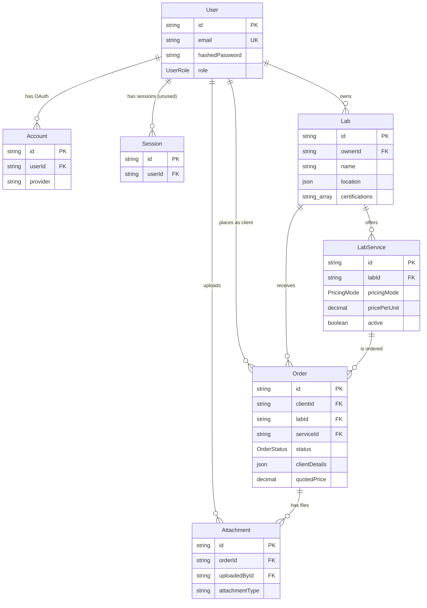
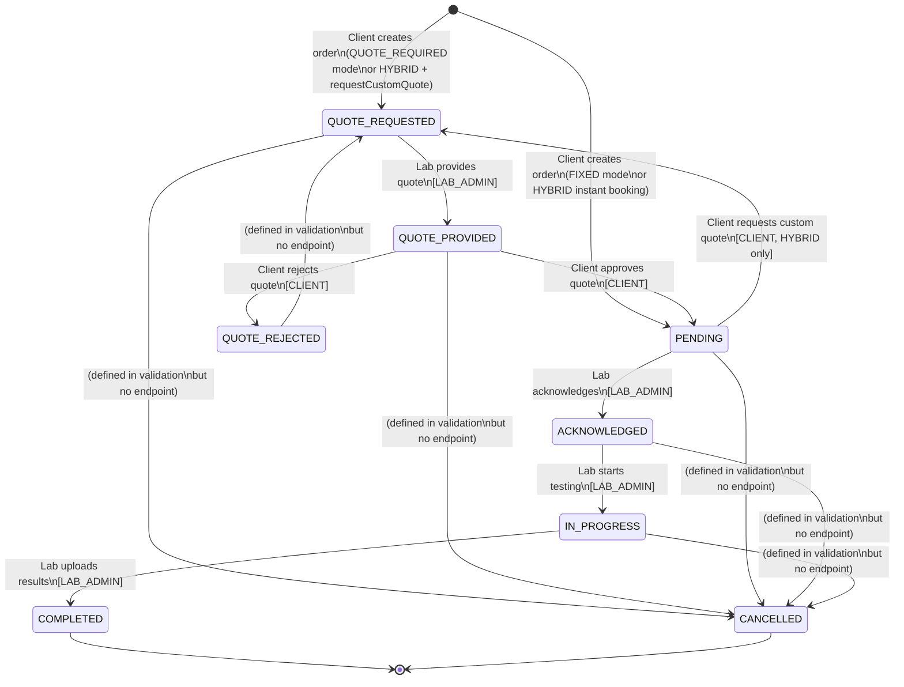
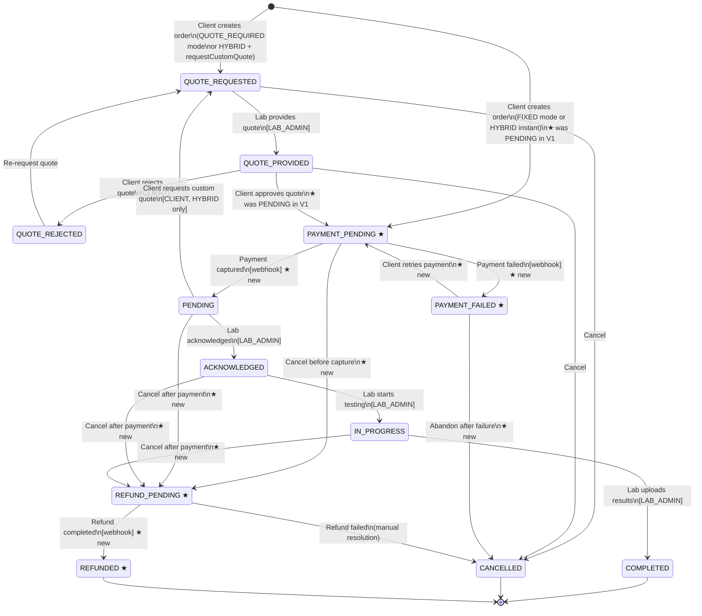

# PipetGo V1 -- State of the System

> Generated: 2026-03-12 | Purpose: V2 rewrite planning baseline

---

## 1. Data Domain

### 1.1 Core Entities

**User** (`users` table)
- `id` String (CUID PK), `email` String (unique), `name` String?, `hashedPassword` String? (bcrypt, nullable for OAuth-only), `emailVerified` DateTime?, `image` String?, `role` UserRole (default CLIENT), `createdAt`, `updatedAt`
- Relations: `accounts[]`, `sessions[]`, `ownedLabs[]`, `clientOrders[]`, `attachments[]`

**Account** (NextAuth OAuth adapter table)
- `id` CUID PK, `userId` FK->User, `type`, `provider`, `providerAccountId`, `refresh_token` Text?, `access_token` Text?, `expires_at` Int?, `token_type`?, `scope`?, `id_token` Text?, `session_state`?
- Unique constraint: `[provider, providerAccountId]`

**Session** (NextAuth session table)
- `id` CUID PK, `sessionToken` String (unique), `userId` FK->User, `expires` DateTime
- Note: Not actually used at runtime -- JWT strategy is configured, making this table vestigial.

**VerificationToken** (NextAuth adapter table)
- `identifier` String, `token` String (unique), `expires` DateTime
- Unique: `[identifier, token]`

**Lab** (`labs` table)
- `id` CUID PK, `ownerId` FK->User, `name` String, `description` String?, `location` Json? (unstructured -- LabLocation type defined in TS but not enforced at DB level), `certifications` String[], `createdAt`, `updatedAt`
- Relations: `owner`, `services[]`, `orders[]`
- No indexes beyond PK. No unique constraint on `ownerId` (allows one user to own multiple labs, though UI assumes single lab).

**LabService** (`lab_services` table)
- `id` CUID PK, `labId` FK->Lab (cascade delete), `name`, `description`?, `category` String (free-text at DB level, constrained by Zod to 6 categories), `pricingMode` PricingMode (default QUOTE_REQUIRED), `pricePerUnit` Decimal?, `unitType` String (default "per_sample"), `turnaroundDays` Int?, `sampleRequirements`?, `active` Boolean (default true), `createdAt`, `updatedAt`
- Index: `[active, category, labId]`

**Order** (`orders` table)
- `id` CUID PK, `clientId` FK->User, `labId` FK->Lab, `serviceId` FK->LabService, `status` OrderStatus (default QUOTE_REQUESTED), `clientDetails` Json (snapshot of client info at order time), `sampleDescription` String, `specialInstructions`?, `quotedPrice` Decimal?, `quotedAt` DateTime?, `quoteNotes`?, `estimatedTurnaroundDays` Int?, `quoteApprovedAt`?, `quoteRejectedAt`?, `quoteRejectedReason`?, `acknowledgedAt`?, `completedAt`?, `createdAt`, `updatedAt`
- Index: `[clientId, status, createdAt DESC]`
- Index: `[labId, status, createdAt DESC]`

**Attachment** (`attachments` table)
- `id` CUID PK, `orderId` FK->Order (cascade delete), `uploadedById` FK->User, `fileName`, `fileUrl`, `fileType`, `fileSize` Int?, `attachmentType` String (free-text at DB: 'specification', 'result', 'accreditation_certificate'), `createdAt`
- Index: `[orderId, attachmentType, createdAt DESC]`

**Enums:**
- `UserRole`: CLIENT, LAB_ADMIN, ADMIN
- `PricingMode`: QUOTE_REQUIRED, FIXED, HYBRID
- `OrderStatus`: QUOTE_REQUESTED, QUOTE_PROVIDED, QUOTE_REJECTED, PENDING, ACKNOWLEDGED, IN_PROGRESS, COMPLETED, CANCELLED

### 1.2 Entity Relationship Map



### 1.3 Schema Critique

**Redundant/Ambiguous Fields:**
- `Order.labId` is denormalized -- derivable from `Order.serviceId -> LabService.labId`. Stored for query convenience but creates update anomaly risk if a service is moved between labs.
- `Order.clientDetails` (Json) snapshots client info at order time. Pragmatic for immutable order records, but the shape diverges between the Zod schema in `src/app/api/orders/route.ts` (lines 14-24: has `contactEmail`, `contactPhone`, `shippingAddress`) and the TypeScript type in `src/types/index.ts` (lines 138-144: has `name`, `email`, `phone`, `address`). No runtime enforcement at DB level.
- `Attachment.attachmentType` is a free-text String at the DB level. The `AttachmentType` enum exists only in TypeScript (`src/types/index.ts` line 32-36), not in Prisma schema. DB cannot enforce valid values.
- `LabService.category` is free-text at DB level. Constrained only by Zod in `src/lib/validations/service.ts` (6 categories) but `src/types/index.ts` defines 8 different categories (`SERVICE_CATEGORIES`, line 366-374). These lists are inconsistent.

**Missing Indexes:**
- `Lab.ownerId` -- no index. Every auth check for LAB_ADMIN does `prisma.lab.findFirst({ where: { ownerId } })`. Needs index.
- `LabService.labId` alone -- the composite index `[active, category, labId]` helps filtered queries but not simple lab-service lookups by `labId`.
- `Attachment.uploadedById` -- no index. Cannot efficiently query "all files uploaded by user X."

**Missing Normalization:**
- Service categories should be a separate `Category` table or DB-level enum rather than free-text String.
- `Lab.certifications` as `String[]` prevents querying "all labs with ISO 17025" efficiently. Should be a join table.
- `Lab.location` as `Json` prevents spatial queries or structured filtering by city/region.

**N+1 Query Traps:**
- `GET /api/orders` includes `attachments: true` for every order in the list. For a lab with 100 orders, each with 3 attachments, this is a single Prisma query with JOIN but returns a large payload. No pagination on order list endpoint.
- `GET /api/analytics` (line 225-235) fetches all orders for monthly breakdown after already running aggregation queries. The monthly breakdown could be done with raw SQL `DATE_TRUNC`.

**V2 Migration Complexity:**
- `Order.clientDetails` (Json) -- migrating to structured fields requires parsing and validating every existing Json blob.
- `Session` table exists but is unused (JWT strategy). Can be dropped but must coordinate with NextAuth adapter expectations.
- All IDs are CUIDs (26 chars). V2 may want UUIDs or ULIDs for sortability.

---

## 2. Quotation-First Business Engine

### 2.1 Order State Machine



### 2.2 State Transition Table

| From | To | Actor | Trigger | API Endpoint | Atomic Check |
|------|-----|-------|---------|--------------|--------------|
| (new) | QUOTE_REQUESTED | CLIENT | Create order (QUOTE_REQUIRED mode, or HYBRID + requestCustomQuote=true) | `POST /api/orders` | N/A |
| (new) | PENDING | CLIENT | Create order (FIXED mode, or HYBRID instant) | `POST /api/orders` | N/A |
| QUOTE_REQUESTED | QUOTE_PROVIDED | LAB_ADMIN | Submit quote with price | `POST /api/orders/[id]/quote` | Yes (`updateMany` where status=QUOTE_REQUESTED) |
| QUOTE_PROVIDED | PENDING | CLIENT | Approve quote (approved=true) | `POST /api/orders/[id]/approve-quote` | Yes (`updateMany` where status=QUOTE_PROVIDED) |
| QUOTE_PROVIDED | QUOTE_REJECTED | CLIENT | Reject quote (approved=false) | `POST /api/orders/[id]/approve-quote` | Yes (`updateMany` where status=QUOTE_PROVIDED) |
| PENDING | QUOTE_REQUESTED | CLIENT | Request custom quote (HYBRID only) | `POST /api/orders/[id]/request-custom-quote` | No (simple `update`, not atomic) |
| PENDING | ACKNOWLEDGED | LAB_ADMIN | Acknowledge order | `PATCH /api/orders/[id]` | No |
| ACKNOWLEDGED | IN_PROGRESS | LAB_ADMIN | Start testing | `PATCH /api/orders/[id]` | No |
| IN_PROGRESS | COMPLETED | LAB_ADMIN | Upload results / complete | `PATCH /api/orders/[id]` | No |
| Any allowed | CANCELLED | LAB_ADMIN or ADMIN | Cancel order | `PATCH /api/orders/[id]` | No |
| QUOTE_REJECTED | QUOTE_REQUESTED | -- | Re-request quote | Defined in validation map but **no endpoint implements this** | N/A |

### 2.3 Business Logic Coupling Analysis

| Concern | Location | Rating | Notes |
|---------|----------|--------|-------|
| Status transition validation (who can move to which status) | `src/app/api/orders/[id]/route.ts` lines 80-86 (role check only); `src/app/api/orders/[id]/quote/route.ts` lines 67-70 (atomic WHERE clause); `src/app/api/orders/[id]/approve-quote/route.ts` lines 91-95 (atomic WHERE clause) | **Coupled** | Transition rules are embedded in each route handler. The `validStatusTransitions` map in `src/lib/validations/order.ts` lines 100-109 is defined but **never imported or used** by any route handler (confirmed by TODO comment on line 113). The PATCH route at `src/app/api/orders/[id]/route.ts` performs NO status transition validation -- any LAB_ADMIN/ADMIN can set status to ACKNOWLEDGED, IN_PROGRESS, COMPLETED, or CANCELLED regardless of current status. |
| Price calculation / quote mutation | `src/app/api/orders/route.ts` lines 48-83 (initial pricing logic for FIXED/HYBRID); `src/app/api/orders/[id]/quote/route.ts` lines 67-78 (quote provision) | **Coupled** | All pricing logic is inline in route handlers. No pricing service or domain model. |
| Notification dispatch | `src/app/api/orders/[id]/quote/route.ts` lines 106-113 (TODO comment); `src/app/api/orders/[id]/approve-quote/route.ts` lines 125-132 (TODO comment); `src/app/api/orders/[id]/request-custom-quote/route.ts` line 112 (TODO comment) | **Missing** | No Notification model in schema. All notification dispatches are TODO comments. No email, webhook, or in-app notification system exists. |
| File attachment handling | `src/app/api/orders/[id]/route.ts` lines 106-117 (attachment creation on COMPLETED); `src/app/dashboard/lab/page.tsx` lines 92-95 (mock file URL generation) | **Coupled** | Attachment creation is inline in the order PATCH handler. The lab dashboard hardcodes mock URLs (`https://example.com/results/...`). UploadThing is listed as a dependency but no integration code was found in the order/attachment flow. |
| Analytics event tracking | `src/app/api/orders/route.ts` lines 105-110; `src/app/api/orders/[id]/quote/route.ts` line 119; `src/app/api/orders/[id]/approve-quote/route.ts` lines 138-140 | **Coupled** | Analytics calls (`analytics.quoteRequested()`, etc.) are inline in route handlers. The analytics module itself (`src/lib/analytics.ts`) calls `window.goatcounter` which requires browser context -- these calls in API routes (server-side) will silently no-op due to `typeof window === 'undefined'` check. Server-side analytics tracking is non-functional. |

---

## 3. Access Control Matrix

### 3.1 Role Permission Table

| Action | CLIENT | LAB_ADMIN | ADMIN |
|--------|--------|-----------|-------|
| Create order (POST /api/orders) | Yes (explicit role check) | No | No |
| View own orders (GET /api/orders) | Yes (filtered by clientId) | N/A | N/A |
| View lab orders (GET /api/orders) | N/A | Yes (filtered by lab.ownerId) | N/A |
| View all orders (GET /api/orders) | No | No | Yes (no filter) |
| View single order (GET /api/orders/[id]) | Yes (own orders) | Yes (own lab's orders) | Yes (all) |
| Provide quote (POST /api/orders/[id]/quote) | No | Yes (own lab, ownership verified) | No |
| Approve/reject quote (POST /api/orders/[id]/approve-quote) | Yes (own orders) | No | No |
| Request custom quote (POST /api/orders/[id]/request-custom-quote) | Yes (own orders, HYBRID only) | No | No |
| Update order status (PATCH /api/orders/[id]) | No | Yes (own lab) | Yes (any) |
| List services (GET /api/services) | Public (no auth) | Public | Public |
| View single service (GET /api/services/[id]) | No | Yes (own lab only) | No |
| Create service (POST /api/services) | No | Yes (own lab) | No |
| Update service (PATCH /api/services/[id]) | No | Yes (own lab) | No |
| Bulk enable/disable services (POST /api/services/bulk) | No | Yes (own lab) | No |
| View analytics (GET /api/analytics) | No | Yes (own lab) | No |
| Set password (POST /api/auth/set-password) | Yes | Yes | Yes |
| Admin dashboard | No (client redirect) | No (client redirect) | Yes (client-side role check) |

### 3.2 Session Validation Patterns

**1. API Route Handlers (primary pattern):**
```typescript
// Pattern used in all API routes
const session = await getServerSession(authOptions)
if (!session?.user) {
  return NextResponse.json({ error: 'Unauthorized' }, { status: 401 })
}
// Then role check:
if (session.user.role !== 'LAB_ADMIN') {
  return NextResponse.json({ error: 'Forbidden' }, { status: 403 })
}
```
Auth+authz is duplicated identically across every route handler. No shared middleware or helper function.

**2. Server Components (dashboard layout only):**
```typescript
// src/app/dashboard/layout.tsx lines 8-14
const session = await getServerSession(authOptions)
if (!session?.user) {
  redirect('/auth/signin')
}
```
Only checks authentication, not role. Role-specific access is deferred to child client components.

**3. Client Components (all dashboard pages):**
```typescript
// Pattern in every dashboard page.tsx
const { data: session, status } = useSession()
useEffect(() => {
  if (status === 'loading') return
  if (!session || session.user.role !== 'LAB_ADMIN') {
    router.push('/auth/signin')
  }
}, [session, status, router])
```
Role enforcement is purely client-side redirect. A user with CLIENT role can still call LAB_ADMIN APIs directly; the API routes enforce server-side. The client-side check is UX-only.

**4. Middleware:**
No `src/middleware.ts` exists. There is no Next.js middleware for route protection. All auth is done per-route.

**Gaps and Inconsistencies:**
- `GET /api/services` (list) requires no authentication. Intentional for public marketplace browsing.
- `GET /api/services/[id]` requires LAB_ADMIN and ownership. This means clients and admins cannot view a single service detail via API -- only the public list endpoint. Likely a bug; clients need service detail to place orders.
- `GET /api/orders/[id]` returns 403 (Forbidden) for unauthorized access (`src/app/api/orders/[id]/route.ts` line 43). This leaks order existence. The quote and approve-quote routes correctly return 404 for both "not found" and "not yours."
- The PATCH `/api/orders/[id]` route does not validate status transitions. A LAB_ADMIN can set an order from QUOTE_REQUESTED directly to COMPLETED, bypassing the entire quote workflow. The `validStatusTransitions` map in `src/lib/validations/order.ts` is dead code.
- `POST /api/orders` checks `session.user.role !== 'CLIENT'` but returns 401 (Unauthorized) instead of 403 (Forbidden) for non-CLIENT roles. Semantic error -- should be 403.
- The admin dashboard (`src/app/dashboard/admin/page.tsx`) computes total revenue client-side by iterating all orders and summing `quotedPrice`. For large datasets this is a performance and accuracy problem.

---

## 4. API Contracts

### 4.1 Endpoint Inventory

| Method | Path | Auth Required | Actor | Summary |
|--------|------|--------------|-------|---------|
| GET | `/api/orders` | Yes | CLIENT, LAB_ADMIN, ADMIN | List orders filtered by role |
| POST | `/api/orders` | Yes | CLIENT | Create order/RFQ |
| GET | `/api/orders/[id]` | Yes | CLIENT (own), LAB_ADMIN (own lab), ADMIN | Get single order |
| PATCH | `/api/orders/[id]` | Yes | LAB_ADMIN (own lab), ADMIN | Update order status |
| POST | `/api/orders/[id]/quote` | Yes | LAB_ADMIN (own lab) | Provide quote |
| POST | `/api/orders/[id]/approve-quote` | Yes | CLIENT (own order) | Approve or reject quote |
| POST | `/api/orders/[id]/request-custom-quote` | Yes | CLIENT (own order) | Request custom quote (HYBRID) |
| GET | `/api/services` | No | Public | List services with pagination/filters |
| POST | `/api/services` | Yes | LAB_ADMIN | Create service |
| GET | `/api/services/[id]` | Yes | LAB_ADMIN (own lab) | Get single service |
| PATCH | `/api/services/[id]` | Yes | LAB_ADMIN (own lab) | Update service or toggle active |
| POST | `/api/services/bulk` | Yes | LAB_ADMIN | Bulk enable/disable services |
| GET | `/api/analytics` | Yes | LAB_ADMIN | Lab analytics dashboard data |
| POST | `/api/auth/set-password` | Yes | Any authenticated | Set password for first time |
| * | `/api/auth/[...nextauth]` | No | Public | NextAuth sign-in/sign-out/session |

### 4.2 Core Endpoint Contracts

**POST /api/orders**
```
Request: {
  serviceId: string,
  sampleDescription: string (min 10),
  specialInstructions?: string,
  requestCustomQuote?: boolean,  // HYBRID mode only
  clientDetails: {
    contactEmail: string (email),
    contactPhone?: string,
    shippingAddress: { street: string, city: string, postal: string, country: string (default "Philippines") },
    organization?: string
  }
}
Response 201: {
  id: string, clientId: string, labId: string, serviceId: string,
  status: "QUOTE_REQUESTED" | "PENDING",
  sampleDescription: string, specialInstructions?: string,
  clientDetails: object, quotedPrice: number | null, quotedAt: string | null,
  createdAt: string, updatedAt: string,
  service: { name, category, ... },
  lab: { name },
  client: { name, email }
}
Response 400: { error: "Validation error", details: ZodError[] }
Response 401: { error: "Unauthorized" }
Response 404: { error: "Service not found" }
```
Note: The inline Zod schema in the route handler (`src/app/api/orders/route.ts` lines 9-25) differs from the shared schema in `src/lib/validations/order.ts` (lines 54-69). The route uses its own `createOrderSchema` with `contactEmail`/`shippingAddress` structure; the shared schema expects `name`/`email`/`phone`/`address`. The shared schema is not imported by the route.

**PATCH /api/orders/[id]**
```
Request: {
  status: "ACKNOWLEDGED" | "IN_PROGRESS" | "COMPLETED" | "CANCELLED",
  resultFileUrl?: string (URL),
  resultFileName?: string
}
Response 200: {
  id, status, ...,
  service: { name }, lab: { name }, client: { name, email }
}
Response 400: { error: "Validation error", details: ZodError[] }
Response 401: { error: "Unauthorized" }
Response 403: { error: "Forbidden" }
Response 404: { error: "Order not found" }
```
Note: Uses its own inline `updateOrderSchema` (`src/app/api/orders/[id]/route.ts` lines 7-11), not the shared one from validations. No status transition validation is performed.

**POST /api/orders/[id]/quote**
```
Request: {
  quotedPrice: number (positive, max 1,000,000),
  estimatedTurnaroundDays?: number (positive int),
  quoteNotes?: string (max 500)
}
Response 200: {
  id, status: "QUOTE_PROVIDED", quotedPrice, quotedAt, quoteNotes,
  estimatedTurnaroundDays,
  service: {...}, lab: {...}, client: {...}
}
Response 400: { error: "Validation error", details: ZodError[] }
Response 401: { error: "Unauthorized" }
Response 403: { error: "Only lab administrators can provide quotes" }
Response 404: { error: "Order not found or access denied" }
Response 409: { error: "Quote already provided (current status: X)" }
```
Note: Uses its own inline `quoteSchema` (`src/app/api/orders/[id]/quote/route.ts` lines 8-12), not the shared `provideQuoteSchema` from `src/lib/validations/quote.ts`. The inline version has slightly different constraints (max 1,000,000 vs min 1 in shared).

**POST /api/orders/[id]/approve-quote**
```
Request: {
  approved: boolean,
  rejectionReason?: string (min 10, max 500, required if approved=false)
}
Response 200: {
  id, status: "PENDING" | "QUOTE_REJECTED",
  quoteApprovedAt | quoteRejectedAt, quoteRejectedReason?,
  service: {...}, lab: {...}, client: {...}, attachments: [...]
}
Response 400: { error: "Validation error", details: ZodError[] }
Response 401: { error: "Unauthorized" }
Response 403: { error: "Only clients can approve or reject quotes" }
Response 404: { error: "Order not found or access denied" }
Response 409: { error: "Quote can only be approved/rejected when status is QUOTE_PROVIDED (current status: X)" }
```
Note: This route correctly imports `approveQuoteSchema` from the shared validations.

**GET /api/services**
```
Query params: page?, pageSize? (max 50), category?, search?, labId?, active? ("all"), format? ("legacy")
Response 200: {
  items: [{ id, labId, name, description, category, pricingMode, pricePerUnit, ..., lab: { id, name, location, certifications } }],
  pagination: { page, pageSize, totalCount, totalPages, hasMore }
}
Response 200 (format=legacy): [items array directly]
```

**GET /api/services/[id]**
```
Response 200: { id, labId, name, description, category, pricingMode, pricePerUnit, ... }
Response 401: { error: "Unauthorized" }
Response 404: { error: "Service not found or access denied" }
```
Note: Restricted to LAB_ADMIN who owns the lab. Clients cannot access this endpoint.

---

## 5. Architectural Debt & Coupling Analysis

### 5.1 Separation of Concerns Violations

**Database queries in page components:**
- No dashboard pages query the DB directly. All use `fetch('/api/...')` from client components. The server component `src/app/dashboard/layout.tsx` calls `getServerSession()` only for auth, not data fetching. This is clean.

**Business logic embedded in UI event handlers:**
- `src/app/dashboard/lab/page.tsx` lines 92-95: Mock file URL generation is hardcoded in the UI component (`https://example.com/results/${orderId}.pdf`). This should be handled server-side.
- `src/app/dashboard/admin/page.tsx` lines 63-70: Revenue computation and category statistics are calculated client-side by iterating all orders. Should be server-side aggregation.
- `src/app/dashboard/lab/orders/[id]/quote/page.tsx` lines 39-56: Uses `useState()` as `useEffect()` equivalent for data fetching (line 39: `useState(() => { async function fetchOrder() {...} })`). This is a misuse of React's `useState` initializer -- it runs on every render, causing repeated fetch calls.

**Auth logic duplicated across routes:**
- The pattern `const session = await getServerSession(authOptions); if (!session?.user) return 401;` is copy-pasted in every route handler. Files:
  - `src/app/api/orders/route.ts` lines 29-31
  - `src/app/api/orders/[id]/route.ts` lines 18-21, 61-64
  - `src/app/api/orders/[id]/quote/route.ts` lines 20-27
  - `src/app/api/orders/[id]/approve-quote/route.ts` lines 33-37
  - `src/app/api/orders/[id]/request-custom-quote/route.ts` lines 30-33
  - `src/app/api/services/route.ts` lines 97-104
  - `src/app/api/services/[id]/route.ts` lines 22-28, 70-76
  - `src/app/api/services/bulk/route.ts` lines 41-44
  - `src/app/api/analytics/route.ts` lines 52-59
  - `src/app/api/auth/set-password/route.ts` lines 38-41

**Duplicate Zod schemas:**
- `POST /api/orders` defines its own `createOrderSchema` inline (route.ts lines 9-25) instead of importing from `src/lib/validations/order.ts`. The shapes are incompatible.
- `PATCH /api/orders/[id]` defines its own `updateOrderSchema` inline (route.ts lines 7-11). The shared version in validations has different field set.
- `POST /api/orders/[id]/quote` defines its own `quoteSchema` inline (route.ts lines 8-12) instead of using `provideQuoteSchema` from `src/lib/validations/quote.ts`.

### 5.2 Missing Layers

**Data Access Layer (repository pattern):**
Absent. Every route handler calls `prisma.*` directly with inline query construction. No abstraction for common queries like "find order with ownership check" which is repeated in 5 route files.

**Domain Service Layer:**
Absent. Business logic (status transitions, pricing mode resolution, quote validation) is scattered across route handlers. The `isValidStatusTransition()` function in `src/lib/validations/order.ts` (line 120) exists but is dead code -- never called by any route.

**Event/Notification System:**
Absent. All notification dispatches are TODO comments. No Notification model in the Prisma schema despite being referenced in TODO code samples. No email service integration.

**Payment Integration Hooks:**
Absent. `quotedPrice` is stored but no payment collection, invoicing, or payment status tracking exists. The Order model has no payment-related fields.

**Rate Limiting on API Routes:**
Partially implemented. Rate limiting infrastructure exists in `src/lib/rate-limit.ts` (Upstash Redis-based) but is only applied to `POST /api/auth/set-password`. No rate limiting on order creation, quote provision, or any other API endpoint. The NextAuth login route has a TODO noting rate limiting was removed due to v4/App Router incompatibility.

**Cancellation Workflow:**
The CANCELLED status exists in the enum and the PATCH route accepts it, but there is no dedicated cancellation endpoint with reason tracking, refund logic, or actor validation (who can cancel at which stage).

### 5.3 V2 Migration Risk Assessment

| Concern | Risk | Notes |
|---------|------|-------|
| Duplicate Zod schemas (inline vs shared) | **High** | V2 must establish single source of truth. Current inline schemas in route handlers diverge from shared validations. Any contract change requires auditing every route file. |
| Dead status transition validation | **High** | `validStatusTransitions` map is defined but unused. PATCH route allows any status jump. V2 must enforce state machine server-side. Current data may contain invalid transitions. |
| Order.clientDetails Json shape divergence | **High** | Two incompatible shapes exist (route schema vs TypeScript type). Migrating existing data requires inspecting every Json blob to determine which shape was stored. |
| No middleware for auth | **Medium** | 10+ routes duplicate auth boilerplate. V2 should use Next.js middleware or a wrapper pattern. Low risk to migrate but high effort. |
| Lab.location as Json | **Medium** | No structured querying possible. V2 needs to decide: normalize to columns, or use JSONB with indexed paths. Existing data shapes must be audited. |
| Lab.certifications as String[] | **Medium** | Cannot efficiently query "labs with X certification." V2 should use a join table. Migration is straightforward (explode array to rows). |
| Session table (unused) | **Low** | JWT strategy means Session table is never read. Can drop in V2 or switch to DB sessions if needed. |
| UploadThing integration gap | **Medium** | Dependency exists in package.json but attachment flow uses mock URLs. V2 must implement real file upload or choose different provider. |
| Analytics server-side no-op | **Medium** | `analytics.*` calls in API routes use GoatCounter's browser API (`window.goatcounter`). These silently fail server-side. V2 needs server-side analytics (PostHog, custom events, etc.). |
| No pagination on GET /api/orders | **Medium** | Returns all orders for a user/lab. Will degrade as order count grows. V2 must add cursor or offset pagination. |
| AttachmentType not in Prisma enum | **Low** | Only constrained in TypeScript. V2 should add DB-level enum. Migration is adding constraint to existing valid data. |
| Category mismatch (6 Zod vs 8 types) | **Low** | `src/lib/validations/service.ts` allows 6 categories; `src/types/index.ts` defines 8. V2 should unify. Existing data may contain values from either set. |

---

## Appendix: File Map

### Authentication & Authorization
| File | Purpose |
|------|---------|
| `src/lib/auth.ts` | NextAuth configuration: JWT strategy, CredentialsProvider, bcrypt auth, session/token callbacks |
| `src/lib/password.ts` | bcrypt hash/verify helpers (referenced but not read) |
| `src/lib/rate-limit.ts` | Upstash Redis rate limiting: 4 limiters defined (login, signup, password-reset, set-password) |
| `src/app/api/auth/[...nextauth]/route.ts` | NextAuth handler (GET/POST passthrough, no rate limiting) |
| `src/app/api/auth/set-password/route.ts` | Password set endpoint with rate limiting (only rate-limited API route) |

### Data Layer
| File | Purpose |
|------|---------|
| `prisma/schema.prisma` | Authoritative database schema: 8 models, 3 enums, 4 indexes |
| `src/lib/db.ts` | Prisma singleton with development hot-reload guard |
| `src/types/index.ts` | TypeScript type definitions mirroring (and extending) Prisma types; includes enums, dashboard types, analytics types |

### Validation
| File | Purpose |
|------|---------|
| `src/lib/validations/auth.ts` | Auth schemas: signIn, signUp, password (with complexity rules), email verification, password reset |
| `src/lib/validations/order.ts` | Order schemas: create, update, attachment, filter; **dead code**: `isValidStatusTransition()` |
| `src/lib/validations/quote.ts` | Quote schemas: provideQuote, approveQuote, requestCustomQuote, pricing mode helper |
| `src/lib/validations/service.ts` | Service schemas: create, update, filter; pricing mode refinement (FIXED/HYBRID require price) |
| `src/lib/validations/lab.ts` | Lab schemas: create/update with location, filter |

### Order Lifecycle (API)
| File | Purpose |
|------|---------|
| `src/app/api/orders/route.ts` | GET (list with role-based filtering) + POST (create with pricing mode resolution) |
| `src/app/api/orders/[id]/route.ts` | GET (single order with auth) + PATCH (status update, no transition validation) |
| `src/app/api/orders/[id]/quote/route.ts` | POST: Lab admin provides quote (atomic update, transaction) |
| `src/app/api/orders/[id]/approve-quote/route.ts` | POST: Client approves/rejects quote (atomic update, transaction) |
| `src/app/api/orders/[id]/request-custom-quote/route.ts` | POST: Client requests custom quote for HYBRID service (non-atomic) |

### Service Management (API)
| File | Purpose |
|------|---------|
| `src/app/api/services/route.ts` | GET (public paginated list) + POST (lab admin creates service) |
| `src/app/api/services/[id]/route.ts` | GET (lab admin only) + PATCH (toggle active or full update) |
| `src/app/api/services/bulk/route.ts` | POST: Bulk enable/disable services (lab admin) |

### Analytics (API)
| File | Purpose |
|------|---------|
| `src/app/api/analytics/route.ts` | GET: Lab admin analytics with aggregation (revenue, quotes, orders, top services) |
| `src/lib/analytics.ts` | GoatCounter event tracking helpers (browser-only, no-ops server-side) |

### Dashboard (UI)
| File | Purpose |
|------|---------|
| `src/app/dashboard/layout.tsx` | Server component: auth gate (redirect to signin if unauthenticated), renders DashboardNav |
| `src/app/dashboard/admin/page.tsx` | Client component: admin overview with all orders, client-side revenue calc |
| `src/app/dashboard/client/page.tsx` | Client component: order list with quote approval/rejection dialogs |
| `src/app/dashboard/lab/page.tsx` | Client component: lab order management with status progression buttons |
| `src/app/dashboard/lab/orders/[id]/quote/page.tsx` | Client component: quote provision form (misuses useState as useEffect) |
| `src/app/dashboard/lab/services/page.tsx` | Client component: service catalog management |
| `src/app/dashboard/lab/analytics/page.tsx` | Client component: analytics dashboard with charts |

---

## 6. V2 Payment Architecture Readiness (Aggregator Integration)

### 6.1 Integration Points in the Quotation-First Workflow

The V1 order state machine (Section 2.1) has four integration points where V2 payment logic must hook in. Each is mapped to the exact V1 transition it extends.

**Integration Point 1: Payment collection after quote approval**

| Attribute | Value |
|-----------|-------|
| V1 transition | `QUOTE_PROVIDED --> PENDING` (client approves quote) |
| V2 change | `QUOTE_PROVIDED --> PAYMENT_PENDING` (new state) |
| Actor | System (triggered by client's approve-quote action) |
| Platform action | Create PayMongo/Xendit Payment Intent for `quotedPrice`. Return checkout URL to client. |
| Notes | The `POST /api/orders/[id]/approve-quote` handler currently sets status to PENDING. In V2, when `approved=true`, it sets status to `PAYMENT_PENDING` and creates a `Transaction` record with the aggregator's payment intent ID. |

**Integration Point 2: Payment collection for fixed-price orders**

| Attribute | Value |
|-----------|-------|
| V1 transition | `(new) --> PENDING` (FIXED mode or HYBRID instant booking) |
| V2 change | `(new) --> PAYMENT_PENDING` (new state) |
| Actor | System (triggered by client's order creation) |
| Platform action | Create Payment Intent for `pricePerUnit` from LabService. Return checkout URL. |
| Notes | `POST /api/orders` currently resolves pricing mode and sets status to PENDING for FIXED/HYBRID-instant. V2 interposes `PAYMENT_PENDING` before lab acknowledgment. |

**Integration Point 3: Payment confirmation via webhook**

| Attribute | Value |
|-----------|-------|
| V1 transition | N/A (new) |
| V2 transition | `PAYMENT_PENDING --> PENDING` |
| Actor | Webhook (PayMongo/Xendit callback) |
| Platform action | Verify webhook signature. Update `Transaction` status to CAPTURED. Set `Order.paidAt`. Advance order to PENDING. Queue payout calculation for lab's cut (commission deducted). |
| Notes | This is a new transition with no V1 equivalent. The order only becomes visible to the lab for acknowledgment after payment clears. |

**Integration Point 4: Payout to lab after order completion**

| Attribute | Value |
|-----------|-------|
| V1 transition | `IN_PROGRESS --> COMPLETED` |
| V2 change | Transition unchanged, but side effect added |
| Actor | System (triggered by lab marking order complete) |
| Platform action | Calculate lab payout (total minus platform commission). Create `Payout` record with status QUEUED. Credit `LabWallet.pendingBalance`. Batch payout runs on schedule (daily/weekly). |
| Notes | Payout is not instant -- it is queued and batched. The lab sees the amount in their wallet as "pending" until the batch transfer executes via PayMongo/Xendit disbursement API. |

**New `OrderStatus` enum values required for V2:**

| Value | Purpose |
|-------|---------|
| `PAYMENT_PENDING` | Order awaiting client payment after quote approval or fixed-price creation |
| `PAYMENT_FAILED` | Payment attempt failed; client can retry |
| `REFUND_PENDING` | Refund initiated (cancellation after payment) |
| `REFUNDED` | Refund completed |

**V2 State Machine (extends V1):**



Note: States marked with `★` are new in V2. All unmarked transitions are inherited from V1.

### 6.2 Prisma Schema Additions (Marketplace Split Model)

**New enums:**

```prisma
enum TransactionStatus {
  PENDING    // Payment intent created, awaiting client action
  PROCESSING // Client initiated payment, awaiting aggregator confirmation
  CAPTURED   // Payment successfully captured
  FAILED     // Payment attempt failed
  REFUNDED   // Full or partial refund completed
}

enum PayoutStatus {
  QUEUED     // Payout calculated, awaiting batch processing
  PROCESSING // Batch submitted to aggregator disbursement API
  COMPLETED  // Funds transferred to lab's bank account
  FAILED     // Disbursement failed (retry or manual resolution)
}
```

**New model: Transaction**

```prisma
model Transaction {
  id                String            @id @default(cuid())
  orderId           String
  externalId        String            @unique  // PayMongo/Xendit payment intent ID
  provider          String            // "paymongo" | "xendit"
  amount            Decimal           @db.Decimal(12, 2)
  currency          String            @default("PHP")
  status            TransactionStatus @default(PENDING)
  paymentMethod     String?           // "gcash", "maya", "qrph", "card", "instapay", "pesonet"
  checkoutUrl       String?           // Redirect URL for client to complete payment
  failureReason     String?
  metadata          Json?             // Raw aggregator response for audit
  capturedAt        DateTime?
  refundedAt        DateTime?
  createdAt         DateTime          @default(now())
  updatedAt         DateTime          @updatedAt

  order Order @relation(fields: [orderId], references: [id])

  @@index([orderId, status])
  @@index([externalId])
  @@index([status, createdAt(sort: Desc)])
  @@map("transactions")
}
```

**New model: Payout**

```prisma
model Payout {
  id                String       @id @default(cuid())
  labId             String
  orderId           String
  transactionId     String
  grossAmount       Decimal      @db.Decimal(12, 2)  // Total payment captured
  platformFee       Decimal      @db.Decimal(12, 2)  // Commission deducted
  netAmount         Decimal      @db.Decimal(12, 2)  // Amount to lab (gross - fee)
  feePercentage     Decimal      @db.Decimal(5, 4)   // Commission rate at time of payout (e.g., 0.0500 = 5%)
  status            PayoutStatus @default(QUEUED)
  externalPayoutId  String?      @unique  // Aggregator disbursement reference ID
  scheduledDate     DateTime?    // When the batch payout is scheduled to run
  completedAt       DateTime?
  failureReason     String?
  createdAt         DateTime     @default(now())
  updatedAt         DateTime     @updatedAt

  lab         Lab         @relation(fields: [labId], references: [id])
  order       Order       @relation(fields: [orderId], references: [id])
  transaction Transaction @relation(fields: [transactionId], references: [id])

  @@index([labId, status])
  @@index([orderId])
  @@index([status, scheduledDate])
  @@map("payouts")
}
```

**New model: LabWallet**

```prisma
model LabWallet {
  id               String   @id @default(cuid())
  labId            String   @unique  // One wallet per lab
  pendingBalance   Decimal  @db.Decimal(12, 2) @default(0)   // Payouts queued but not yet disbursed
  availableBalance Decimal  @db.Decimal(12, 2) @default(0)   // Payouts completed, available for withdrawal
  withdrawnTotal   Decimal  @db.Decimal(12, 2) @default(0)   // Lifetime withdrawn amount
  currency         String   @default("PHP")
  createdAt        DateTime @default(now())
  updatedAt        DateTime @updatedAt

  lab Lab @relation(fields: [labId], references: [id])

  @@map("lab_wallets")
}
```

**Fields to add to existing `Order` model:**

```prisma
// Add to the Order model in schema.prisma:
  paymentIntentId     String?    // Denormalized from Transaction.externalId for quick lookup
  paidAt              DateTime?  // When payment was captured (denormalized from Transaction.capturedAt)
  paymentMethod       String?    // "gcash", "maya", "qrph", etc. (denormalized for display)
  refundedAt          DateTime?  // When refund completed (if applicable)
```

**Relation additions to existing models:**

```prisma
// Add to Order model:
  transactions Transaction[]
  payouts      Payout[]

// Add to Lab model:
  wallet  LabWallet?
  payouts Payout[]
```

**V1 schema changes required now (to avoid dead ends):**

1. **Add `PAYMENT_PENDING`, `PAYMENT_FAILED`, `REFUND_PENDING`, `REFUNDED` to the `OrderStatus` enum.** This is a non-breaking additive change. Existing code never matches on these values, so no runtime impact. Doing this in V1 means the migration from V1 data to V2 schema does not require an enum alteration on a populated table.
2. **Add the four nullable fields to `Order`** (`paymentIntentId`, `paidAt`, `paymentMethod`, `refundedAt`). All nullable, so no data backfill needed. Existing orders will have `null` for all four, which is correct (V1 has no payments).
3. **Do NOT add the `Transaction`, `Payout`, or `LabWallet` models to V1.** These are V2-only. Adding them prematurely creates maintenance burden with no benefit.

### 6.3 Webhook Handler Architecture (Vertical Slice)

**6.3.1 Webhook receiver location**

```
src/app/api/webhooks/paymongo/route.ts   (PayMongo events)
src/app/api/webhooks/xendit/route.ts     (Xendit events, if dual-provider)
```

The webhook receiver must be isolated from the order domain slice for three reasons:
1. **Authentication boundary.** Webhook endpoints authenticate via HMAC signature, not NextAuth session. Mixing them into the order API (`/api/orders/...`) would create a route that bypasses session auth, creating a security confusion risk.
2. **Coupling direction.** The webhook handler depends on the payment slice, which depends on the order slice. If the webhook lived inside the order slice, the dependency would be circular (order -> payment -> order).
3. **Rate and retry characteristics.** Aggregator webhooks have their own retry schedule (PayMongo retries 3x over 24h). The handler needs independent error handling and idempotency guarantees that differ from user-facing API routes.

**6.3.2 Signature verification**

The webhook handler must verify the request signature before processing any event. Both PayMongo and Xendit use HMAC-SHA256.

```typescript
// Pseudocode -- must be the FIRST operation in the route handler
export async function POST(req: Request) {
  const rawBody = await req.text()
  const signature = req.headers.get('paymongo-signature') // or 'x-callback-token' for Xendit

  const expectedSignature = crypto
    .createHmac('sha256', process.env.PAYMONGO_WEBHOOK_SECRET!)
    .update(rawBody)
    .digest('hex')

  // Constant-time comparison to prevent timing attacks
  const isValid = crypto.timingSafeEqual(
    Buffer.from(signature ?? ''),
    Buffer.from(expectedSignature)
  )

  if (!isValid) {
    return Response.json({ error: 'Invalid signature' }, { status: 401 })
  }

  const event = JSON.parse(rawBody)
  // ... proceed to event routing
}
```

Critical: `rawBody` must be read as raw text before JSON parsing. If the framework parses JSON first and re-serializes, the signature will not match.

**6.3.3 Event routing**

Instead of a monolithic switch statement, use a registry pattern where each event type maps to a handler function. Handlers are slice-owned.

```typescript
// src/lib/webhooks/registry.ts
type WebhookHandler = (event: WebhookEvent) => Promise<void>

const handlers: Record<string, WebhookHandler> = {}

export function registerWebhookHandler(eventType: string, handler: WebhookHandler) {
  handlers[eventType] = handler
}

export function getWebhookHandler(eventType: string): WebhookHandler | undefined {
  return handlers[eventType]
}
```

```typescript
// src/lib/payment/webhook-handlers.ts (payment slice owns these)
import { registerWebhookHandler } from '@/lib/webhooks/registry'

registerWebhookHandler('payment.paid', async (event) => {
  // Update Transaction status to CAPTURED
  // Advance Order from PAYMENT_PENDING to PENDING
  // Queue Payout calculation
})

registerWebhookHandler('payment.failed', async (event) => {
  // Update Transaction status to FAILED
  // Advance Order from PAYMENT_PENDING to PAYMENT_FAILED
})

registerWebhookHandler('refund.created', async (event) => {
  // Update Transaction status to REFUNDED
  // Advance Order from REFUND_PENDING to REFUNDED
  // Reverse LabWallet.pendingBalance if payout was QUEUED
})
```

```typescript
// src/app/api/webhooks/paymongo/route.ts (the receiver)
import { getWebhookHandler } from '@/lib/webhooks/registry'
import '@/lib/payment/webhook-handlers' // Side-effect import: registers handlers

export async function POST(req: Request) {
  // ... signature verification (see 6.3.2) ...
  const event = JSON.parse(rawBody)

  const handler = getWebhookHandler(event.data.attributes.type)
  if (!handler) {
    // Unknown event type -- acknowledge to prevent retries, log for monitoring
    console.warn(`Unhandled webhook event type: ${event.data.attributes.type}`)
    return Response.json({ received: true }, { status: 200 })
  }

  await handler(event)
  return Response.json({ received: true }, { status: 200 })
}
```

This pattern allows adding new event handlers (e.g., `payout.completed`) without modifying the webhook route file.

**6.3.4 Idempotency**

PayMongo and Xendit may retry webhook delivery. The `Transaction` model provides the idempotency mechanism:

1. Every webhook event includes a unique event ID (PayMongo: `event.id`, Xendit: `callback_id`).
2. Before processing, the handler checks if a `Transaction` with that `externalId` already has the target status.
3. If the transaction is already in the target state, return 200 immediately (acknowledge without reprocessing).

```typescript
// Inside payment.paid handler:
async function handlePaymentPaid(event: WebhookEvent) {
  const paymentIntentId = event.data.attributes.payment_intent_id

  // Atomic check-and-update: only transitions from PENDING/PROCESSING to CAPTURED
  const result = await prisma.transaction.updateMany({
    where: {
      externalId: paymentIntentId,
      status: { in: ['PENDING', 'PROCESSING'] }  // Only process if not already captured
    },
    data: {
      status: 'CAPTURED',
      capturedAt: new Date(),
      paymentMethod: event.data.attributes.source?.type ?? null,
      metadata: event.data.attributes
    }
  })

  if (result.count === 0) {
    // Already processed or unknown transaction -- idempotent no-op
    return
  }

  // Proceed with order status advancement and payout queueing
  // ... (within a Prisma transaction for atomicity)
}
```

The `updateMany` with a `status` WHERE clause is the same atomic guard pattern used by the V1 quote provision endpoint (`POST /api/orders/[id]/quote`). This ensures that even if two webhook deliveries arrive simultaneously, only one will match the WHERE clause and execute the state change.

**6.3.5 Coupling boundary**

The payment slice exposes exactly one interface to the order slice: a domain event.

```typescript
// src/lib/payment/events.ts
export type PaymentCompletedEvent = {
  orderId: string
  transactionId: string
  amount: Decimal
  paymentMethod: string
  capturedAt: Date
}

export type PaymentFailedEvent = {
  orderId: string
  transactionId: string
  failureReason: string
}

export type RefundCompletedEvent = {
  orderId: string
  transactionId: string
  refundedAmount: Decimal
}
```

In V2's architecture, the payment slice's webhook handlers emit these events. The order slice subscribes and advances order status accordingly. In a Next.js monolith (no message bus), this is implemented as a direct function call from the payment handler into an order service function:

```typescript
// src/lib/order/handlers.ts (order slice)
export async function onPaymentCompleted(event: PaymentCompletedEvent): Promise<void> {
  await prisma.order.updateMany({
    where: { id: event.orderId, status: 'PAYMENT_PENDING' },
    data: {
      status: 'PENDING',
      paidAt: event.capturedAt,
      paymentMethod: event.paymentMethod
    }
  })
}
```

The coupling contract: the payment slice knows about `PaymentCompletedEvent` and calls `onPaymentCompleted()`. The order slice knows nothing about PayMongo, Xendit, webhooks, or transaction internals. If the payment provider changes, only the payment slice changes. If the order state machine changes, only the order slice changes. The event type is the stable interface between them.
