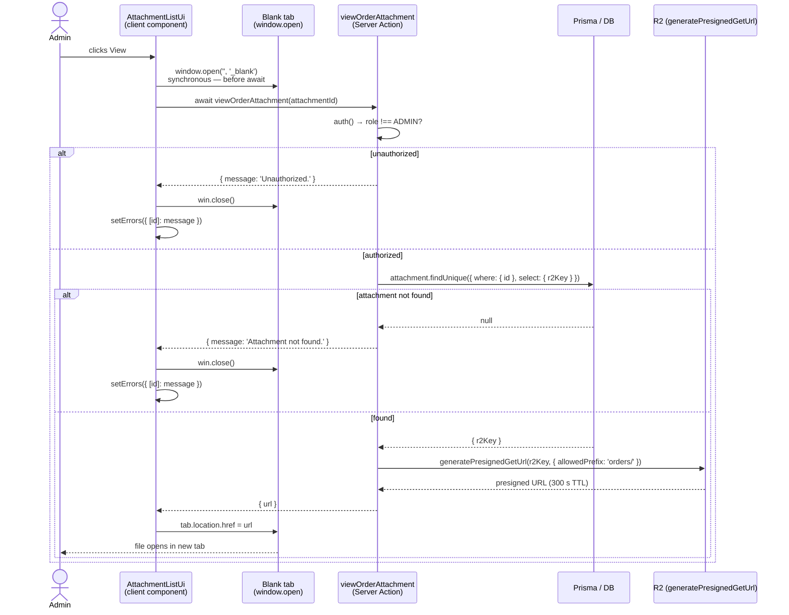

# order-oversight — Design Decisions

## Why read-only

T-13b is deliberately mutation-free. Refund, force-status, and reassign-lab touches
the payment-event state machine and requires a separate privilege-escalation audit
(T-13c). Any write reintroduces the audit burden that deferred T-13c. The layout
guard provides layer-1 protection; every RSC page and Server Action independently
re-checks `session.user.role === 'ADMIN'` to prevent TOCTOU (DL-005).

## Two-layer auth / TOCTOU (DL-005)

Server Actions and RSC pages are independently POST-invocable — the layout guard
does not protect them. Every file in this slice performs its own role check.
Relying on the layout guard alone leaks cross-tenant order, PII, and financial
data to an unauthenticated POST.

## PII minimization — list vs detail (DL-002)

The list view surfaces only order id, status, lab name, client display name, amount,
and timestamps. Full `ClientProfile` PII (email, phone, address) appears only on the
detail page, justified by support use behind the ADMIN gate per RA 10173 data
minimization. No PII or financial data is tracked in analytics (global standard).

## Cursor pagination over offset (DL-003)

`findMany` with `cursor + skip:1` provides stable pagination under concurrent
inserts/deletes; offset pagination drifts when rows are added or removed between
page loads. PAGE_SIZE=25 caps each query to a small result set. The backward branch
reverses `orderBy` to `[{createdAt:asc},{id:asc}]`, fetches, then `.reverse()`s
the result to restore display (newest-first) order.

## On-demand presigned GET (DL-004)

Attachment URLs are not embedded in the RSC payload. `viewOrderAttachment` mints a
300s presigned GET URL per click, re-checking ADMIN role on every call. The R2 key
is loaded from the stored `Attachment.r2Key` row — never derived from client input.
`generatePresignedGetUrl` enforces the `orders/` prefix guard as defense-in-depth.
ADMIN has cross-tenant access by design — no `clientId` ownership check.

**DIAG-001 — On-demand admin attachment download**

## Inline Decimal / Date serialization (DL-007)

All `Prisma.Decimal` fields are serialized via `.toFixed(2)` (`.toFixed(4)` for
`feePercentage`) and all `Date` fields via `.toISOString()` at the RSC boundary.
Next.js cannot serialize these types; the failure is a runtime crash, not a tsc
error. DTO field types reflect the serialized form (`amount: string`, not
`amount: Decimal`). No shared serialize helper is introduced — the inline-map
convention (per `src/features/labs/wallet/page.tsx`) is followed.

## ADMIN bootstrap — no in-app promotion

ADMIN role is provisioned via direct database UPDATE per environment. No in-app
promotion path exists — any UI that granted or revoked ADMIN would require its own
privilege-escalation audit. Dev environment: alfieprojects.dev@gmail.com is
bootstrapped.
